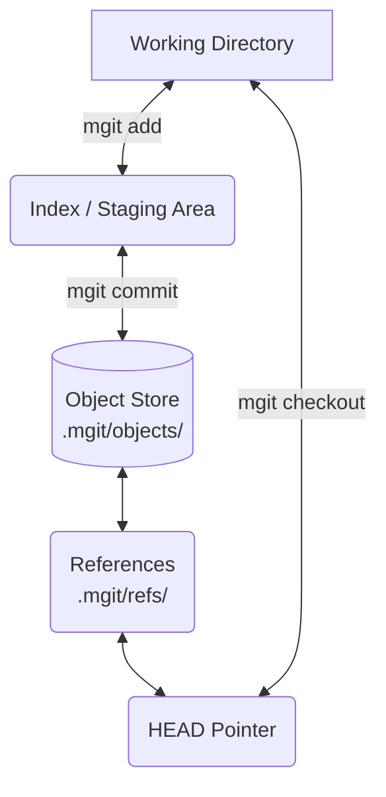

# mgit - Technical Architecture & Documentation

This document provides an in-depth look at the internal architecture, algorithms, and design decisions behind `mgit`. It is intended for developers and engineers who want to understand how a Version Control System operates from first principles.

## 1. System Architecture

At its core, `mgit` operates by managing a hidden directory (`.mgit/`) at the root of the initialized project. This folder acts as the local database for the repository.

### Content-Addressable Storage
All file contents and commit snapshots are stored in the `.mgit/objects/` directory. `mgit` uses **SHA-1 hashing** to uniquely identify data, ensuring data integrity and deduplication.
*   **Blobs**: When a file is staged (`mgit add`), its content is hashed. The hash becomes the filename in the `objects/` directory, and the content is the file's payload.
*   **Commits**: A commit object is a JSON representation containing the author's message, timestamp, a map of all files (with their respective blob hashes at that point in time), and an array of parent commit hashes.

### The Index (Staging Area)
The index acts as the crucial middle-ground between the working directory and the permanent commit history. It is serialized and stored in `.mgit/index`.
*   It operates as a Key-Value map: `filepath -> blob_hash`.
*   `mgit add` writes to the index.
*   `mgit commit` packages the current state of the index into a new Commit Object.

### References (Refs) & HEAD
References are lightweight pointers to commit hashes.
*   **Branches**: Stored in `.mgit/refs/heads/`. A branch is a simple text file containing the SHA-1 hash of the latest commit on that branch.
*   **HEAD**: Stored at `.mgit/HEAD`. It points to the currently checked-out branch (e.g., `ref: refs/heads/main`) or directly to a commit hash in the case of a "detached HEAD".

---

## 2. Advanced Subsystems

### Reset Mechanics
The `mgit reset` command allows for history manipulation and rollback across three distinct operational layers. It leverages a rigorous security check (`IsValidRefName`) to prevent directory traversal attacks.
1.  **Soft Reset (`--soft`)**: Updates the branch reference (`HEAD`) to point to the target commit. The index (staging area) and working directory remain completely untouched.
2.  **Mixed Reset (`--mixed` / default)**: Updates the branch reference *and* rewrites the index to match the tree of the target commit. The working directory is left alone.
3.  **Hard Reset (`--hard`)**: Updates the branch reference, rewrites the index, *and* violently overwrites the working directory to precisely match the target commit, discarding any uncommitted local changes.

### 3-Way Merge Algorithm
The `mgit merge` functionality replicates true version control merging by employing a deterministic 3-way merge algorithm.

1.  **Common Ancestor Resolution**: When merging `Branch B` into `Branch A`, `mgit` traverses the directed acyclic graph (DAG) of parent history using Breadth-First Search (BFS) to find the most recent common commit (the Ancestor). 
2.  **Conflict Detection**: `mgit` compares the file hashes of `HEAD`, `Target`, and the `Ancestor`:
    *   **Fast-Forward**: If `HEAD` is the ancestor, the merge simply moves the `HEAD` pointer forward to the target commit.
    *   **Clean 3-Way Merge**: If a file was changed in `Target` but not in `HEAD` (relative to the Ancestor), the `Target` version is automatically accepted.
    *   **Merge Conflicts**: If a file was modified differently in *both* `HEAD` and `Target`, `mgit` detects a conflict.
3.  **Conflict Resolution State**:
    *   The merge process halts.
    *   The conflicting file is rewritten in the working directory, injected with standard Git conflict markers (`<<<<<<< HEAD`, `=======`, `>>>>>>>`).
    *   The target branch hash is saved to `.mgit/MERGE_HEAD`.
    *   Upon manual resolution by the user (`mgit add` and `mgit commit`), the commit subsystem detects `MERGE_HEAD` and automatically generates a true **dual-parent merge commit**.

### Workspace Safety
To prevent accidental data loss, commands that manipulate the working directory (such as `checkout` and `merge`) implement strict safeguards. `EnsureCleanWorkspace` actively checks the index and working tree, halting the operation if uncommitted changes are detected.

---

## 3. Embedded Web UI Architecture

`mgit` features a built-in HTTP server (`mgit ui`) that hosts a local Graphical User Interface for managing the repository visually.

### The `//go:embed` Directive
Instead of requiring users to download a separate web application, the compiled React bundle (`web/dist/`) is injected directly into the `mgit` Go executable at compile time using Go's native `//go:embed` directive.
*   This makes the `mgit` binary entirely self-contained and portable. No external assets are loaded at runtime.
*   The Go backend utilizes standard HTTP multiplexers to serve the embedded static files, while simultaneously providing dynamic API endpoints (`/api/status`, `/api/commit`, etc.) that execute core `mgit` operations.

### Frontend Engineering
The frontend is built using **React, Vite, and TypeScript**, completely decoupling the UI rendering from the core version control logic.
*   **Reactive Polling**: The UI utilizes a background polling interval (`setInterval`) to fetch the repository status every 3 seconds. This allows the GUI to instantly and automatically reflect changes made via the CLI or external editors, completely eliminating the need for manual page refreshes.
*   **Custom Component System**: Moving away from native browser pop-ups, the application utilizes a bespoke component architecture (e.g., custom Modals for destructive actions, Toast context providers for non-intrusive notifications).
*   **Keyboard Shortcuts**: Advanced user experience flows, such as pressing `Cmd/Ctrl + Enter` to commit or `Enter` to seamlessly create branches.
